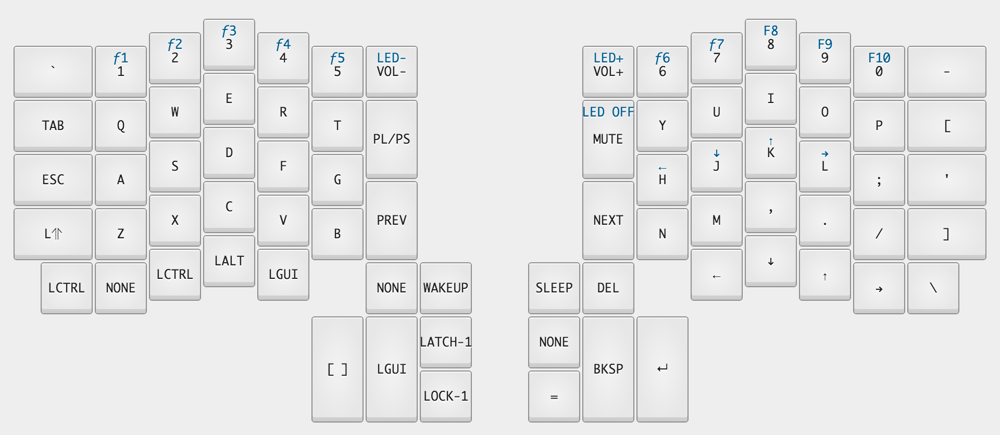

=====================================================================
ErgoDox Infinity Configuration
=====================================================================

Installation
============
1. Use either the `Massdrop`_ or `Input Club`_ online configurators to set your layout.
2. Download the layout.
3. Download the `Teensy Loader Application`_ or use the `provided loader`_.
4. Load the .hex file in the Teensy application.
5. Use a paperclip to reset your ErgoDox.
6. Use the Teensy application to program your ErgoDox.
7. Use the Teensy application to reboot your ErgoDox.

Layout
======

.. _Massdrop: https://keyboard-configurator.massdrop.com/ext/ergodox
.. _Input Club: https://input.club/configurator
.. _Teensy Loader Application: http://www.pjrc.com/teensy/loader.html
.. _provided loader: https://github.com/JamshedVesuna/ergodox/tree/master/teensy
